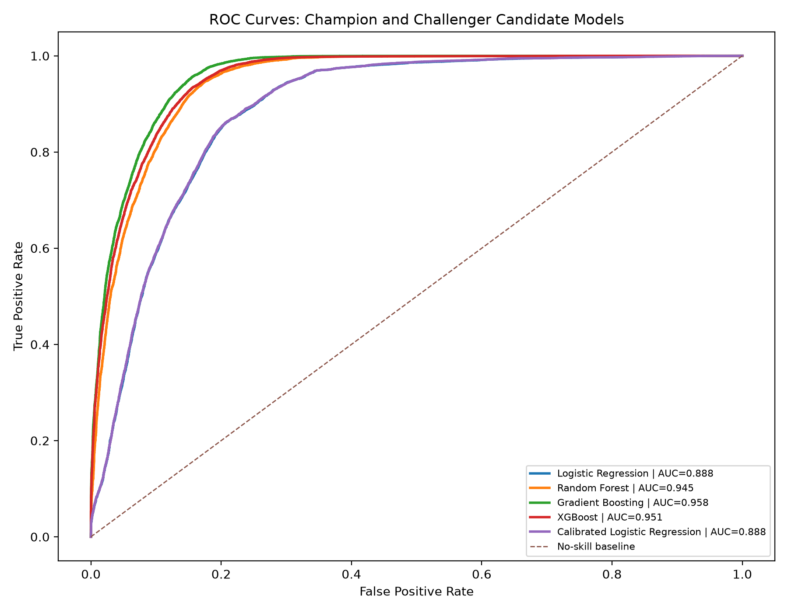
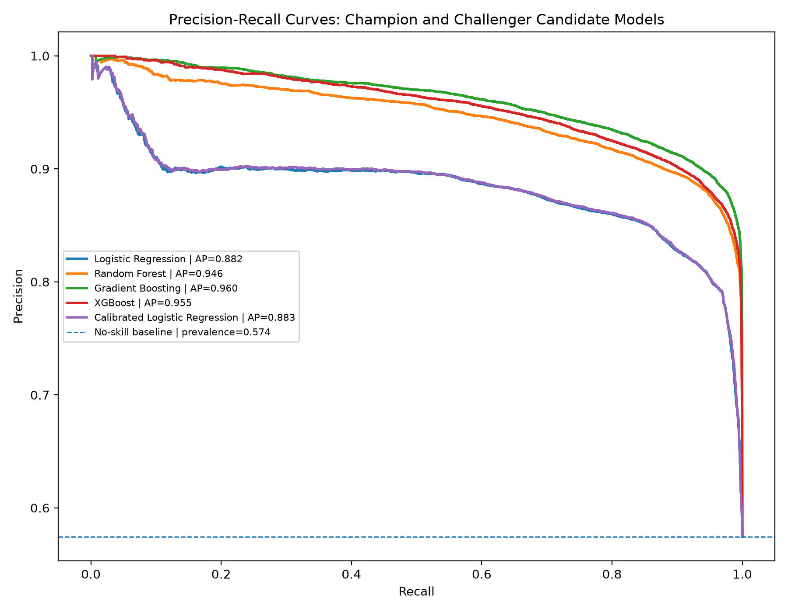
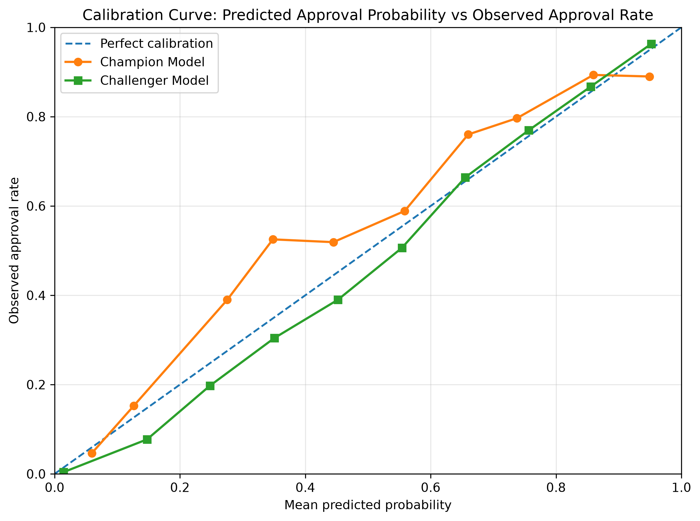
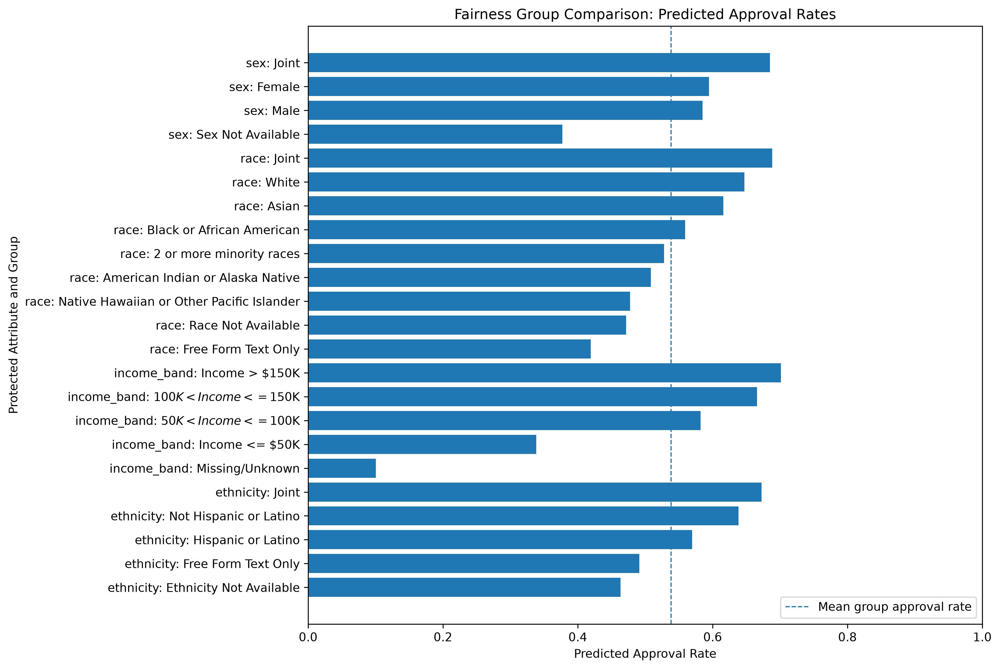
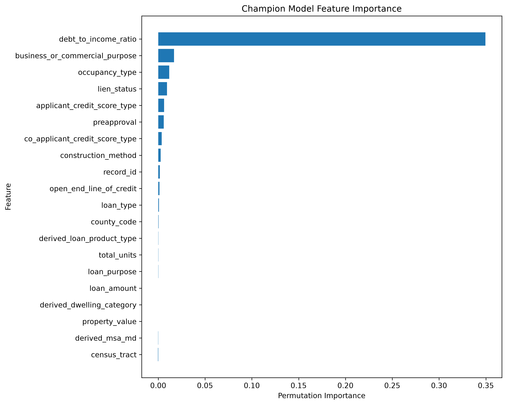
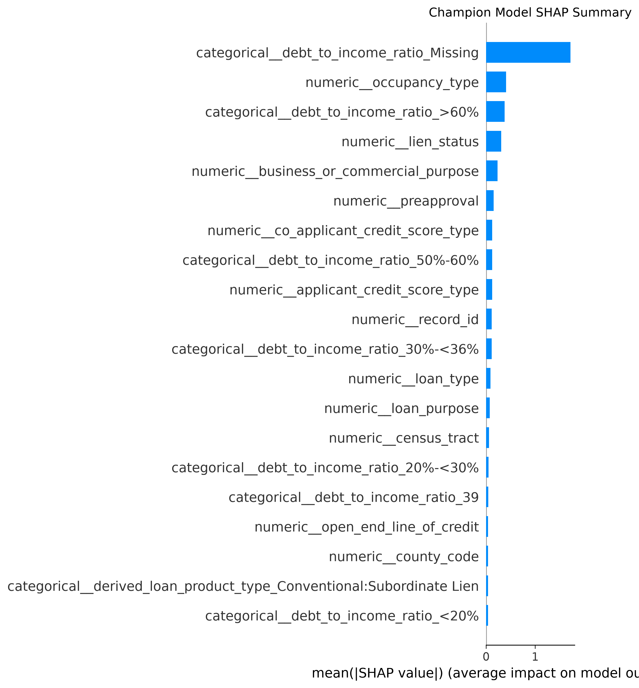
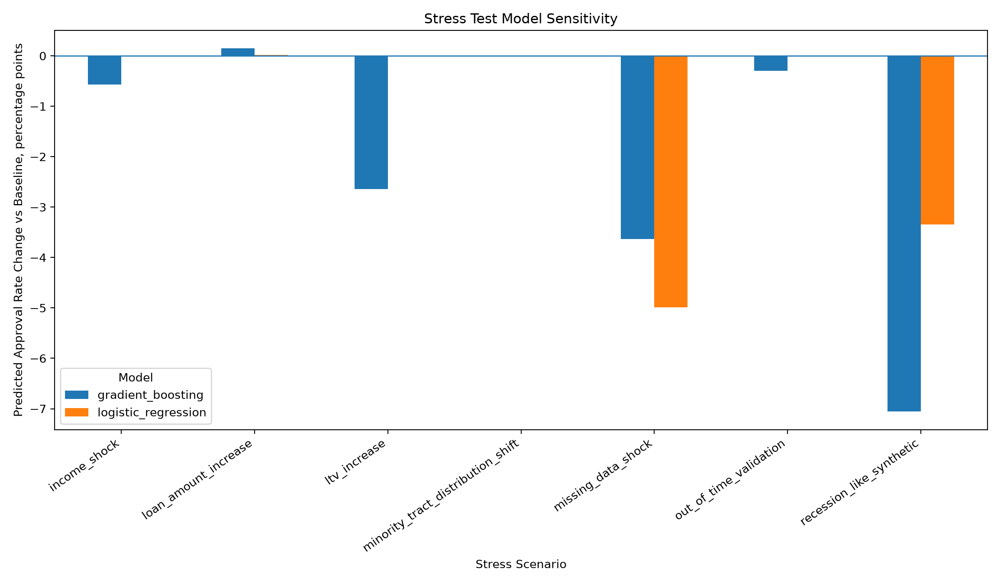
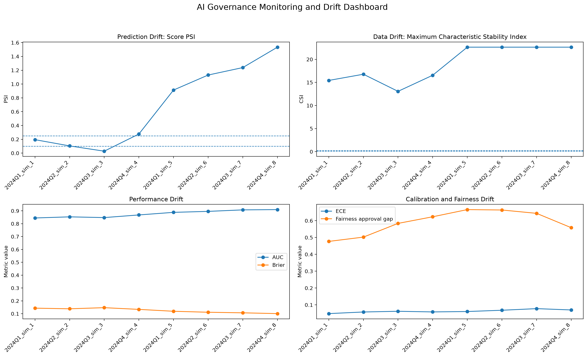
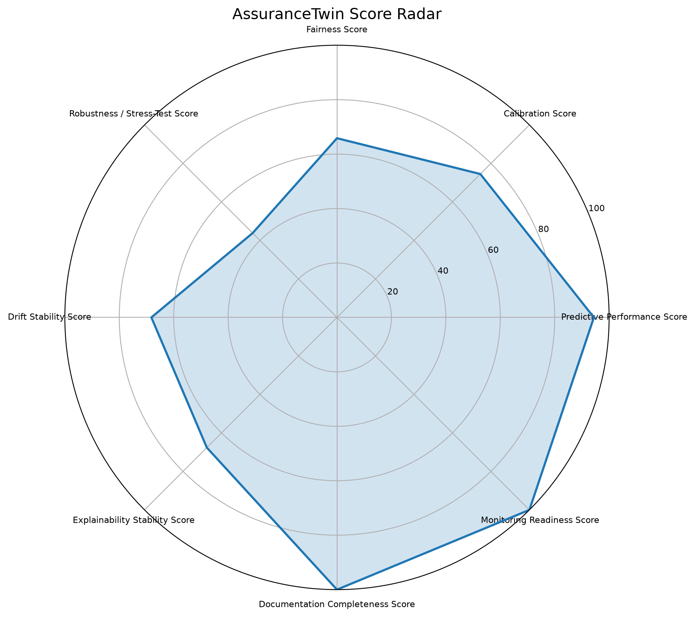

# Model Validation Committee Report

**Project:** AssuranceTwin AI — Model Validation and Governance

**Generated:** 2026-06-26 12:40:49

**Final Validation Recommendation:** **Conditional Approval**

**AssuranceTwin Score:** **73.37**

---

## 1. Executive Summary

This report consolidates the independent validation evidence for the candidate credit decision model. The review evaluates predictive performance, calibration, fairness, challenger model behavior, explainability, stress testing, drift stability, documentation completeness, and monitoring readiness.

The final model validation recommendation is **Conditional Approval**.

Primary basis for recommendation:

- AssuranceTwin Score is 73.37, which supports conditional approval.
- Calibration review identified probability-quality concerns requiring remediation or monitoring.
- Fairness review identified potential adverse impact or material group-level performance differences.
- Monitoring review identified material drift risk requiring lifecycle controls.
- Use should be permitted only with documented remediation, monitoring, and governance controls.

Key model summary:

- Champion model identified from performance table: **Gradient Boosting**
- Challenger model identified from performance table: **XGBoost**
- Selection metric: **AUC**
- Champion metric value: **0.9578**
- Challenger metric value: **0.9513**

## 2. Model Purpose and Use

The model is designed to support credit decision analysis using HMDA-style mortgage application data. The target variable is a binary approval outcome, where approved applications are coded as 1 and non-approved applications are coded as 0. The intended use is analytical model validation, governance demonstration, and model-risk committee review rather than live automated underwriting.

The model should be treated as a high-impact decision-support model because the output relates to credit access. Accordingly, the validation standard emphasizes transparency, fairness, lifecycle monitoring, and documented approval controls.

### Model Inventory

| model_id | model_name | model_type | business_use | risk_tier | training_data | target_variable | owner | validator | materiality |
| --- | --- | --- | --- | --- | --- | --- | --- | --- | --- |
| HMDA-APPROVAL-001 | HMDA Mortgage Application Approval Classifier | Supervised binary classification | Research and model-validation demonstration using public HMDA loan/application records to estimate mortgage applicati... | High | data/processed/hmda_modeling_dataset.csv; derived from data/raw/hmda_lar_nj_2024.csv | approved | Yousef Nejatbakhsh | Independent model validation reviewer / project validator | High; the project concerns lending outcomes, approval classification, fairness review, and governance documentation. |

_Table preview limited to 1 rows and 10 columns._

## 3. Data Description

The clean modeling dataset was found at `data/processed/hmda_modeling_dataset.csv`.

- Number of records: **290004**
- Number of columns: **36**

Available column preview: `record_id, activity_year, lei, state_code, county_code, census_tract, derived_msa_md, action_taken_code, action_taken_label, approved, loan_type, loan_purpose, lien_status, preapproval, reverse_mortgage, open_end_line_of_credit, business_or_commercial_purpose, derived_loan_product_type, derived_dwelling_category, construction_method, occupancy_type, total_units, manufactured_home_secured_property_type, manufactured_home_land_property_interest, loan_amount, ...`

### Target Distribution

| approved | count | share |
| --- | --- | --- |
| 1.0000 | 166577.0000 | 0.5744 |
| 0.0000 | 123427.0000 | 0.4256 |

### Modeling Dataset Summary

| created_at | script | raw_file | raw_file_size_mb | raw_rows | raw_columns | modeling_rows | modeling_columns |
| --- | --- | --- | --- | --- | --- | --- | --- |
| 2026-06-26 09:21:01 | scripts/03_create_clean_hmda_dataset.py | data\raw\hmda_lar_nj_2024.csv | 117.1900 | 323940 | 99 | 290004 | 36 |

_Table preview limited to 1 rows and 8 columns._

### Existing Target Distribution Table

| approved | target_label | row_count | percent |
| --- | --- | --- | --- |
| 0 | not_approved_or_not_completed | 123427 | 42.5604 |
| 1 | approved_or_origination_related | 166577 | 57.4396 |

## 4. Conceptual Soundness Review

Conceptual soundness was reviewed by assessing whether the model objective, target construction, candidate predictors, validation framework, and governance controls are aligned with the stated business use. The model development design separates predictive performance from governance acceptability. A model with stronger AUC is not automatically considered acceptable unless calibration, fairness, stress behavior, monitoring readiness, and documentation quality are also satisfactory.

Conceptual review observations:

- The binary approval target is appropriate for a credit decision modeling demonstration.
- The validation workflow includes independent testing rather than relying only on development metrics.
- Champion/challenger comparison supports model-risk governance by testing whether alternatives produce more stable or more governable behavior.
- Fairness and monitoring components are necessary because aggregate accuracy can mask group-level harm and post-deployment degradation.

## 5. Development Methodology

The development methodology uses a reproducible Python workflow with separate scripts for data inspection, dataset cleaning, model inventory, champion/challenger model training, independent validation, calibration analysis, fairness testing, explainability, stress testing, monitoring simulation, and final scoring.

Development artifacts reviewed:

- `scripts/03_create_clean_hmda_dataset.py` — Found
- `scripts/04_create_model_inventory.py` — Found
- `scripts/05_train_champion_challenger_models.py` — Found
- `scripts/06_independent_validation_metrics.py` — Found
- `scripts/07_fairness_bias_testing.py` — Found
- `scripts/08_calibration_analysis.py` — Found
- `scripts/09_explainability_stability.py` — Found
- `scripts/10_stress_testing.py` — Found
- `scripts/11_monitoring_drift_simulation.py` — Found
- `scripts/12_assurancetwin_score.py` — Found

## 6. Independent Validation Results

Independent validation results assess discrimination, classification quality, probability accuracy, confusion-matrix behavior, approval rates, and error rates. These metrics are used to evaluate whether the model is sufficiently reliable for the stated validation use case.

| model_name | model_file | saved_object_type | saved_object_keys | classification_threshold | validation_n | actual_approval_rate | predicted_approval_rate |
| --- | --- | --- | --- | --- | --- | --- | --- |
| Champion Model | models\champion_model.pkl | dict | model; model_name; selection_role; selection_logic; target_column; feature_columns; numeric_features; categorical_fea... | 0.5000 | 58001 | 0.5744 | 0.5985 |
| Challenger Model | models\challenger_model.pkl | dict | model; model_name; selection_role; selection_logic; target_column; feature_columns; numeric_features; categorical_fea... | 0.5000 | 58001 | 0.5744 | 0.6326 |

_Table preview limited to 2 rows and 8 columns._

## 7. Challenger Model Review

The challenger model review compares the selected champion model against alternative algorithms. The purpose is not only to identify the most predictive model, but also to assess whether the selected model is defensible from a validation, stability, transparency, and governance perspective.

| model_name | roc_auc | average_precision | accuracy | balanced_accuracy | precision | recall | f1 | brier_score | log_loss |
| --- | --- | --- | --- | --- | --- | --- | --- | --- | --- |
| Logistic Regression | 0.8877 | 0.8825 | 0.8324 | 0.8252 | 0.8408 | 0.8736 | 0.8569 | 0.1237 | 0.3980 |
| Calibrated Logistic Regression | 0.8884 | 0.8833 | 0.8343 | 0.8254 | 0.8358 | 0.8855 | 0.8600 | 0.1203 | 0.3913 |
| Gradient Boosting | 0.9578 | 0.9605 | 0.9090 | 0.8979 | 0.8816 | 0.9721 | 0.9246 | 0.0695 | 0.2340 |
| Random Forest | 0.9450 | 0.9463 | 0.8941 | 0.8830 | 0.8709 | 0.9575 | 0.9122 | 0.0854 | 0.2861 |
| XGBoost | 0.9513 | 0.9549 | 0.8969 | 0.8878 | 0.8811 | 0.9484 | 0.9135 | 0.0781 | 0.2610 |

_Table preview limited to 5 rows and 10 columns._

Challenger review conclusion:

The apparent champion model is **Gradient Boosting**, based on **AUC** with value **0.9578**.
The apparent challenger model is **XGBoost**, with value **0.9513** on the same selection metric.

## 8. Calibration Review

Calibration review evaluates whether predicted probabilities are reliable. In credit decision settings, probability quality matters because poorly calibrated scores can lead to incorrect approval thresholds, misleading risk segmentation, and weak monitoring triggers.

| model_name | n_observations | observed_approval_rate | mean_predicted_probability | probability_min | probability_25pct | probability_median | probability_75pct |
| --- | --- | --- | --- | --- | --- | --- | --- |
| Champion Model | 58001 | 0.5744 | 0.5378 | 0.0036 | 0.1003 | 0.6835 | 0.8538 |
| Challenger Model | 58001 | 0.5744 | 0.5755 | 0.0005 | 0.0238 | 0.7948 | 0.9335 |

_Table preview limited to 2 rows and 8 columns._

Calibration risk flags:

- Calibration error column `maximum_calibration_error` exceeds 0.08.

## 9. Fairness and Bias Review

Fairness review evaluates group-level performance and approval behavior across protected or policy-relevant segments. The review considers approval-rate differences, disparate impact ratio, false-negative-rate gaps, false-positive-rate gaps, equal opportunity differences, and calibration by group when available.

| attribute | group | reference_group | n | small_group_flag | actual_positives | actual_negatives | actual_approval_rate | predicted_approval_rate | approval_rate_difference |
| --- | --- | --- | --- | --- | --- | --- | --- | --- | --- |
| race | Free Form Text Only | Joint | 155 | False | 41 | 114 | 0.2645 | 0.4194 | -0.2690 |
| race | Race Not Available | Joint | 62332 | False | 32187 | 30145 | 0.5164 | 0.4717 | -0.2166 |
| race | Native Hawaiian or Other Pacific Islander | Joint | 624 | False | 235 | 389 | 0.3766 | 0.4776 | -0.2107 |
| race | American Indian or Alaska Native | Joint | 1253 | False | 505 | 748 | 0.4030 | 0.5084 | -0.1799 |
| race | 2 or more minority races | Joint | 631 | False | 281 | 350 | 0.4453 | 0.5277 | -0.1606 |
| race | Black or African American | Joint | 25436 | False | 12310 | 13126 | 0.4840 | 0.5593 | -0.1290 |
| race | Asian | Joint | 31821 | False | 18142 | 13679 | 0.5701 | 0.6157 | -0.0726 |
| race | White | Joint | 162731 | False | 99592 | 63139 | 0.6120 | 0.6470 | -0.0414 |
| race | Joint | Joint | 5021 | False | 3284 | 1737 | 0.6541 | 0.6883 | 0.0000 |
| ethnicity | Ethnicity Not Available | Joint | 54597 | False | 28680 | 25917 | 0.5253 | 0.4633 | -0.2094 |
| ethnicity | Free Form Text Only | Joint | 224 | False | 86 | 138 | 0.3839 | 0.4911 | -0.1816 |
| ethnicity | Hispanic or Latino | Joint | 36919 | False | 18785 | 18134 | 0.5088 | 0.5697 | -0.1030 |
| ethnicity | Not Hispanic or Latino | Joint | 190910 | False | 114482 | 76428 | 0.5997 | 0.6385 | -0.0342 |
| ethnicity | Joint | Joint | 7354 | False | 4544 | 2810 | 0.6179 | 0.6727 | 0.0000 |
| sex | Sex Not Available | Joint | 31220 | False | 16187 | 15033 | 0.5185 | 0.3772 | -0.3079 |
| sex | Male | Joint | 103513 | False | 56215 | 47298 | 0.5431 | 0.5851 | -0.1001 |
| sex | Female | Joint | 60049 | False | 32742 | 27307 | 0.5453 | 0.5946 | -0.0905 |
| sex | Joint | Joint | 95222 | False | 61433 | 33789 | 0.6452 | 0.6851 | 0.0000 |
| income_band | Missing/Unknown | Income > $150K | 21099 | False | 12847 | 8252 | 0.6089 | 0.1004 | -0.6007 |
| income_band | Income <= $50K | Income > $150K | 19785 | False | 6385 | 13400 | 0.3227 | 0.3382 | -0.3629 |
| income_band | $50K < Income <= $100K | Income > $150K | 65331 | False | 33208 | 32123 | 0.5083 | 0.5819 | -0.1192 |
| income_band | $100K < Income <= $150K | Income > $150K | 67727 | False | 40243 | 27484 | 0.5942 | 0.6657 | -0.0355 |
| income_band | Income > $150K | Income > $150K | 116062 | False | 73894 | 42168 | 0.6367 | 0.7011 | 0.0000 |

_Table preview limited to 23 rows and 10 columns._

Fairness risk flags:

- Material group-level difference detected in `approval_rate_difference`.
- Material group-level difference detected in `equal_opportunity_difference`.
- Material group-level difference detected in `false_negative_rate_gap`.
- Material group-level difference detected in `false_positive_rate_gap`.
- Potential adverse impact: minimum `disparate_impact_ratio` is below 0.80.

### Fairness Validation Report Excerpt

# Fairness and Bias Validation Report

## 1. Validation Purpose

This report evaluates whether the HMDA approval model creates material group-level disparities even when overall model performance appears acceptable. This is a central AI-governance concern for high-stakes credit and lending models.

## 2. Data and Model Scope

- Modeling dataset: `C:/Users/nejat/OneDrive/Desktop/UN/Skills/GitHub 2026/AssuranceTwin AI - Model Validation Governance/assurancetwin-ai-model-validation-governance/data/processed/hmda_modeling_dataset.csv`
- Number of evaluated records: `290,004`
- Target column: `approved`
- Prediction source: `C:\Users\nejat\OneDrive\Desktop\UN\Skills\GitHub 2026\AssuranceTwin AI - Model Validation Governance\assurancetwin-ai-model-validation-governance\models\champion_model.pkl using saved feature columns`
- Classification threshold: `0.50`

## 3. Protected-Group Construction

- race derived from `derived_race`.
- ethnicity derived from `derived_ethnicity`.
- sex derived from `derived_sex`.
- income_band derived from `income`.
- minority_tract_band could not be derived because no minority-tract-like column was found.

## 4. Overall Model Context

| Metric | Value |
|---|---|
| AUC | 0.8872 |
| Accuracy | 0.8327 |
| Actual approval rate | 57.44% |
| Predicted approval rate | 59.75% |
| False positive rate | 22.37% |
| False negative rate | 12.55% |
| True positive rate | 87.45% |
| Brier score | 0.1240 |

## 5. Attribute-Level Fairness Summary

| attribute | groups_tested | reference_group | lowest_dir_group | lowest_disparate_impact_ratio | largest_fnr_gap_group | largest_fnr_gap | largest_fpr_gap_group | largest_fpr_gap | largest_equal_opportunity_gap_group | largest_equal_opportunity_difference | largest_calibration_error_group | largest_calibration_error |
| --- | --- | --- | --- | --- | --- | --- | --- | --- | --- | --- | --- | --- |
| ethnicity | 5 | Joint | Ethnicity Not Available | 0.6887 | Ethnicity Not Available | 0.2288 | Ethnicity Not Available | -0.0540 | Ethnicity Not Available | -0.2288 | Ethnicity Not Available | 0.0498 |
| income_band | 5 | Income > $150K | Missing/Unknown | 0.1432 | Missing/Unknown | 0.8112 | Missing/Unknown | -0.2236 | Missing/Unknown | -0.8112 | Missing/Unknown | 0.2806 |
| race | 9 | Joint | Free Form Text Only | 0.6093 | Race Not Available | 0.2102 | Black or African American | 0.0452 | Race Not Available | -0.2102 | Free Form Text Only | 0.0963 |
| sex | 4 | Joint | Sex Not Available | 0.5505 | Sex Not Avai

[Excerpt truncated.]

## 10. Explainability Review

Explainability review assesses whether the model's drivers are understandable and whether explanations remain stable across time splits, demographic groups, and model alternatives. Explanation instability is a governance concern because it can indicate that the model is relying on unstable proxy relationships.

| comparison_type | dimension | segment | model | n_rows | n_positive | positive_rate | reference_model |
| --- | --- | --- | --- | --- | --- | --- | --- |
| reference | overall | overall | champion | 290004 | 166577 | 0.5744 | champion |
| group_vs_overall | race | White | champion | 162731 | 99592 | 0.6120 | champion |
| group_vs_overall | race | Race Not Available | champion | 62332 | 32187 | 0.5164 | champion |
| group_vs_overall | race | Asian | champion | 31821 | 18142 | 0.5701 | champion |
| group_vs_overall | race | Black or African American | champion | 25436 | 12310 | 0.4840 | champion |
| group_vs_overall | race | Joint | champion | 5021 | 3284 | 0.6541 | champion |
| group_vs_overall | race | American Indian or Alaska Native | champion | 1253 | 505 | 0.4030 | champion |
| group_vs_overall | race | 2 or more minority races | champion | 631 | 281 | 0.4453 | champion |
| group_vs_overall | race | Native Hawaiian or Other Pacific Islander | champion | 624 | 235 | 0.3766 | champion |
| group_vs_overall | race | Free Form Text Only | champion | 155 | 41 | 0.2645 | champion |
| group_vs_overall | ethnicity | Not Hispanic or Latino | champion | 190910 | 114482 | 0.5997 | champion |
| group_vs_overall | ethnicity | Ethnicity Not Available | champion | 54597 | 28680 | 0.5253 | champion |
| group_vs_overall | ethnicity | Hispanic or Latino | champion | 36919 | 18785 | 0.5088 | champion |
| group_vs_overall | ethnicity | Joint | champion | 7354 | 4544 | 0.6179 | champion |
| group_vs_overall | ethnicity | Free Form Text Only | champion | 224 | 86 | 0.3839 | champion |
| group_vs_overall | sex | Male | champion | 103513 | 56215 | 0.5431 | champion |
| group_vs_overall | sex | Joint | champion | 95222 | 61433 | 0.6452 | champion |
| group_vs_overall | sex | Female | champion | 60049 | 32742 | 0.5453 | champion |
| group_vs_overall | sex | Sex Not Available | champion | 31220 | 16187 | 0.5185 | champion |
| group_vs_overall | income_band | medium | champion | 89635 | 54241 | 0.6051 | champion |

_Table preview limited to 20 rows and 8 columns._

## 11. Stress Testing

Stress testing evaluates model sensitivity under adverse or unusual scenarios, including income shocks, loan amount increases, LTV increases, missing-data shocks, minority-tract distribution shifts, out-of-time validation, and recession-like synthetic conditions. The objective is to determine whether model behavior remains plausible under conditions that differ from ordinary validation data.

| scenario | model_name | model_source | n_records | actual_approval_rate | predicted_approval_rate | predicted_denial_rate | average_predicted_probability | approval_rate_delta_pp | avg_probability_delta_pp |
| --- | --- | --- | --- | --- | --- | --- | --- | --- | --- |
| baseline | logistic_regression | models\champion_model.pkl | 87002 | 0.5744 | 0.3635 | 0.6365 | 0.3338 | 0.0000 | 0.0000 |
| baseline | gradient_boosting | models\challenger_model.pkl | 87002 | 0.5744 | 0.5285 | 0.4715 | 0.4860 | 0.0000 | 0.0000 |
| income_shock | logistic_regression | models\champion_model.pkl | 87002 | 0.5744 | 0.3635 | 0.6365 | 0.3339 | 0.0023 | 0.0057 |
| income_shock | gradient_boosting | models\challenger_model.pkl | 87002 | 0.5744 | 0.5228 | 0.4772 | 0.4810 | -0.5655 | -0.4941 |
| loan_amount_increase | logistic_regression | models\champion_model.pkl | 87002 | 0.5744 | 0.3637 | 0.6363 | 0.3341 | 0.0172 | 0.0273 |
| loan_amount_increase | gradient_boosting | models\challenger_model.pkl | 87002 | 0.5744 | 0.5300 | 0.4700 | 0.4877 | 0.1471 | 0.1696 |
| ltv_increase | logistic_regression | models\champion_model.pkl | 87002 | 0.5744 | 0.3635 | 0.6365 | 0.3338 | 0.0000 | -0.0002 |
| ltv_increase | gradient_boosting | models\challenger_model.pkl | 87002 | 0.5744 | 0.5021 | 0.4979 | 0.4552 | -2.6425 | -3.0775 |
| missing_data_shock | logistic_regression | models\champion_model.pkl | 87002 | 0.5744 | 0.3136 | 0.6864 | 0.3013 | -4.9861 | -3.2548 |
| missing_data_shock | gradient_boosting | models\challenger_model.pkl | 87002 | 0.5744 | 0.4922 | 0.5078 | 0.4566 | -3.6298 | -2.9338 |
| minority_tract_distribution_shift | logistic_regression | models\champion_model.pkl | 87002 | 0.5744 | 0.3635 | 0.6365 | 0.3338 | 0.0000 | 0.0000 |
| minority_tract_distribution_shift | gradient_boosting | models\challenger_model.pkl | 87002 | 0.5744 | 0.5285 | 0.4715 | 0.4860 | 0.0000 | 0.0000 |
| out_of_time_validation | logistic_regression | models\champion_model.pkl | 17401 | 0.5776 | 0.3634 | 0.6366 | 0.3334 | -0.0059 | -0.0436 |
| out_of_time_validation | gradient_boosting | models\challenger_model.pkl | 17401 | 0.5776 | 0.5255 | 0.4745 | 0.4849 | -0.2995 | -0.1110 |
| recession_like_synthetic | logistic_regression | models\champion_model.pkl | 87002 | 0.5744 | 0.3300 | 0.6700 | 0.3119 | -3.3459 | -2.1946 |
| recession_like_synthetic | gradient_boosting | models\challenger_model.pkl | 87002 | 0.5744 | 0.4579 | 0.5421 | 0.4219 | -7.0550 | -6.4105 |

_Table preview limited to 16 rows and 10 columns._

### Stress Testing Report Excerpt

# Stress Testing Report

## Purpose

This report evaluates whether model outputs remain stable under adverse financial-risk, data-quality, portfolio-mix, and time-shift conditions. The analysis is designed as an independent model-validation stress test, not merely as a predictive-performance exercise.

## Inputs

- Modeling dataset: `data\processed\hmda_modeling_dataset.csv`
- Target variable: `approved`
- Validation sample size: `87,002`
- Probability threshold: `0.50`
- Results table: `reports\tables\stress_test_results.csv`
- Sensitivity figure: `reports\figures\stress_test_model_sensitivity.png`

## Models evaluated

| Model | Source |
|---|---|
| gradient_boosting | `models\challenger_model.pkl` |
| logistic_regression | `models\champion_model.pkl` |

## Stress scenarios

| Scenario | Implementation note |
|---|---|
| baseline | Original validation sample. |
| income_shock | Reduced 'income' by 20 percent. |
| loan_amount_increase | Increased 'loan_amount' by 15 percent. |
| ltv_increase | Increased 'loan_to_value_ratio' by 10 percentage points. |
| minority_tract_distribution_shift | Minority-tract column not found; scenario returned unchanged data. |
| missing_data_shock | Set approximately 15 percent of values to missing for 8 high-impact columns. |
| out_of_time_validation | No usable multi-period time column found; used final 20 percent of ordered records as a proxy out-of-time window. |
| recession_like_synthetic | income -15 percent using 'income'; loan amount +10 percent using 'loan_amount'; LTV +15 percentage points using 'loan_to_value_ratio'; property value -10 percent using 'property_value'; DTI +10 percent using 'debt_to_income_ratio'; 10 percent missingness introduced into stressed financial fields. |

## Baseline model behavior

| Model | AUC | Brier score | Approval rate | FPR | FNR |
|---|---:|---:|---:|---:|---:|
| gradient_boosting | 0.9227 | 0.1270 | 52.85% | 14.62% | 18.83% |
| logistic_regression | 0.7574 | 0.2614 | 36.35% | 12.24% | 45.79% |

## Most sensitive stress results

| Model | Scenario | Approval-rate delta | Probability delta | AUC delta | Brier delta |
|---|---|---:|---:|---:|---:|
| gradient_boosting | recession_like_synthetic | -7.06 pp | -6.41 pp | -0.0158 | 0.0338 |
| gradient_boosting | missing_data_shock | -3.63 pp | -2.93 pp | -0.0127 | 0.0200 |
| gradient_boosting | ltv_increase | -2.64 pp | -3.08 pp | -0.0052 | 0.0122 |
| logistic_regression | missing_data_shock | -4.99 pp | -3.25 pp | -0.0285 | 0.0294 |
| lo

[Excerpt truncated.]

## 12. Drift and Monitoring Plan

The monitoring plan evaluates population stability, characteristic stability, data drift, prediction drift, performance drift, fairness drift, and calibration drift. These controls are required because model performance and fairness characteristics can degrade after deployment or when applicant populations shift.

| monitoring_period | period_role | n_records | model_source | used_existing_model_artifact | event_rate | score_mean | approval_rate | approval_rate_change_vs_baseline | auc |
| --- | --- | --- | --- | --- | --- | --- | --- | --- | --- |
| 2024Q1_sim_1 | Baseline train period | 36251 | models\champion_model.pkl | True | 0.4366 | 0.4455 | 0.5259 | -0.0390 | 0.8446 |
| 2024Q2_sim_2 | Baseline train period | 36250 | models\champion_model.pkl | True | 0.4908 | 0.4716 | 0.5625 | -0.0024 | 0.8534 |
| 2024Q3_sim_3 | Baseline train period | 36251 | models\champion_model.pkl | True | 0.5524 | 0.5117 | 0.5762 | 0.0113 | 0.8477 |
| 2024Q4_sim_4 | Baseline train period | 36250 | models\champion_model.pkl | True | 0.5847 | 0.5383 | 0.5950 | 0.0301 | 0.8682 |
| 2024Q1_sim_5 | Monitoring period | 36250 | models\champion_model.pkl | True | 0.6213 | 0.5700 | 0.6220 | 0.0571 | 0.8883 |
| 2024Q2_sim_6 | Monitoring period | 36251 | models\champion_model.pkl | True | 0.6335 | 0.5756 | 0.6299 | 0.0650 | 0.8959 |
| 2024Q3_sim_7 | Monitoring period | 36250 | models\champion_model.pkl | True | 0.6329 | 0.5677 | 0.6174 | 0.0525 | 0.9076 |
| 2024Q4_sim_8 | Monitoring period | 36251 | models\champion_model.pkl | True | 0.6430 | 0.5894 | 0.6303 | 0.0654 | 0.9098 |

_Table preview limited to 8 rows and 10 columns._

Drift and monitoring risk flags:

- Material drift detected in `csi_max`.
- Material drift detected in `csi_mean`.
- Material drift detected in `prediction_psi`.

### Monitoring Plan Excerpt

# Monitoring and Drift Simulation Plan

## 1. Purpose
This document defines an ongoing monitoring framework for the HMDA approval model used in this repository. The objective is to detect material deterioration after model development, including data drift, prediction drift, performance drift, fairness drift, and calibration drift.

## 2. Monitoring Design
- **Target variable:** `approved`
- **Model used for monitoring:** `models\champion_model.pkl`
- **Existing model artifact used:** `True`
- **Period source:** Deterministic pseudo-quarter simulation because no usable timestamp was found
- **Baseline train periods:** 2024Q1_sim_1, 2024Q2_sim_2, 2024Q3_sim_3, 2024Q4_sim_4
- **Monitoring periods:** 2024Q1_sim_5, 2024Q2_sim_6, 2024Q3_sim_7, 2024Q4_sim_8
- **Synthetic periods used:** `True`
- **Limitation:** The processed public HMDA file did not provide a usable transaction-level timestamp. The script therefore created deterministic pseudo-periods. These periods support governance simulation, but they should be replaced with true monthly or quarterly production cohorts in a deployed system.

## 3. Metrics
The monitoring process computes the following controls:
- **Population Stability Index:** drift in the model score distribution versus the baseline period.
- **Characteristic Stability Index:** drift in selected input-feature distributions versus the baseline period.
- **Data drift:** maximum and average CSI across monitored characteristics.
- **Prediction drift:** PSI of predicted probabilities and movement in the model approval rate.
- **Performance drift:** AUC, accuracy, balanced accuracy, precision, recall, F1, Brier score, false-positive rate, and false-negative rate.
- **Fairness drift:** group-level approval-rate gap, false-negative-rate gap, and false-positive-rate gap.
- **Calibration drift:** expected calibration error and Brier score movement versus baseline.

## 4. Thresholds and Escalation
| Metric family | Green | Amber | Red |
|---|---:|---:|---:|
| PSI or CSI | < 0.10 | 0.10 to < 0.25 | >= 0.25 |
| AUC change vs. baseline | > -0.03 | -0.05 to -0.03 | <= -0.05 |
| Brier score increase | < 0.015 | 0.015 to < 0.030 | >= 0.030 |
| ECE increase | < 0.020 | 0.020 to < 0.040 | >= 0.040 |
| Group approval-rate gap | < 0.10 | 0.10 to < 0.15 | >= 0.15 |

Recommended escalation:
- **Green:** Continue scheduled monitoring.
- **Amber:** Perform analyst review, feature-level diagnosis, and business-context assessment.
- **Red:** Open a model-risk issue,

[Excerpt truncated.]

## 13. Model Limitations

The following limitations should be considered before any production interpretation:

- The project is a validation and governance demonstration, not a production underwriting system.
- HMDA-style public data may not contain all variables used in an actual credit underwriting process.
- Approval outcome labels may reflect historical decision patterns and may therefore embed historical policy, market, or institutional bias.
- Fairness metrics are sensitive to group definitions, sample size, threshold choice, and target construction.
- Calibration and drift results should be re-evaluated periodically using fresh out-of-time data.
- Explainability outputs should be interpreted as model-behavior diagnostics, not causal proof.
- Stress scenarios are synthetic and should be supplemented with institution-specific macroeconomic and portfolio-risk assumptions.

## 14. Governance Recommendations

Recommended governance actions:

- Maintain this model in a formal model inventory with owner, validator, use case, materiality, and approval status.
- Require independent validation refresh before any change in target definition, feature set, population, or decision threshold.
- Track monthly or quarterly drift metrics, including PSI, CSI, prediction drift, calibration drift, and fairness drift.
- Establish escalation thresholds for material drift, adverse impact, or degraded calibration.
- Review approval-rate differences and error-rate differences by protected or policy-relevant groups.
- Document challenger model results and explain why the champion model is acceptable from both performance and governance perspectives.
- Store all validation artifacts, figures, scorecards, and committee recommendations in the repository.
- Require model-risk committee approval before any production use or external decision-support use.

### AssuranceTwin Scorecard

| component | weight | score_0_to_100 | weighted_points | status | evidence_file |
| --- | --- | --- | --- | --- | --- |
| Predictive Performance Score | 0.2000 | 94.4000 | 18.8800 | Strong | reports\tables\independent_validation_metrics.csv; reports\tables\model_performance_summary.csv |
| Calibration Score | 0.1500 | 74.5000 | 11.1700 | Acceptable | reports\tables\calibration_summary.csv; reports\tables\independent_validation_metrics.csv |
| Fairness Score | 0.2000 | 65.8400 | 13.1700 | Needs remediation | reports\tables\fairness_metrics.csv |
| Robustness / Stress-Test Score | 0.1500 | 43.8200 | 6.5700 | Insufficient evidence or high risk | reports\tables\stress_test_results.csv |
| Drift Stability Score | 0.1000 | 68.2000 | 6.8200 | Needs remediation | reports\tables\drift_monitoring_summary.csv |
| Explainability Stability Score | 0.1000 | 67.6300 | 6.7600 | Needs remediation | reports\tables\explanation_stability.csv |
| Documentation Completeness Score | 0.0500 | 100.0000 | 5.0000 | Strong | README.md; docs\model_inventory_template.md; reports\tables\model_inventory.csv; reports\validation\model_validation_... |
| Monitoring Readiness Score | 0.0500 | 100.0000 | 5.0000 | Strong | reports\validation\monitoring_plan.md; reports\tables\drift_monitoring_summary.csv; reports\figures\drift_dashboard_p... |
| AssuranceTwin Score | 1.0000 | 73.3700 | 73.3700 | Acceptable | Aggregate score from all model-governance components |

## 15. Approval / Conditional Approval / Rejection Recommendation

**Final recommendation:** **Conditional Approval**

Recommendation rationale:

- AssuranceTwin Score is 73.37, which supports conditional approval.
- Calibration review identified probability-quality concerns requiring remediation or monitoring.
- Fairness review identified potential adverse impact or material group-level performance differences.
- Monitoring review identified material drift risk requiring lifecycle controls.
- Use should be permitted only with documented remediation, monitoring, and governance controls.

The model may be conditionally approved for the stated validation use case only if the documented conditions are addressed. Required conditions include continued monitoring, review of flagged fairness, calibration, or drift issues, and maintenance of complete validation documentation.

## Appendix A. Report Input Inventory

The full report input inventory was saved to `reports/tables/model_validation_report_inputs.csv`.

| artifact | path | exists | artifact_type |
| --- | --- | --- | --- |
| Model inventory | reports/tables/model_inventory.csv | True | csv |
| Model performance summary | reports/tables/model_performance_summary.csv | True | csv |
| Independent validation metrics | reports/tables/independent_validation_metrics.csv | True | csv |
| Calibration summary | reports/tables/calibration_summary.csv | True | csv |
| Fairness metrics | reports/tables/fairness_metrics.csv | True | csv |
| Explanation stability | reports/tables/explanation_stability.csv | True | csv |
| Stress test results | reports/tables/stress_test_results.csv | True | csv |
| Drift monitoring summary | reports/tables/drift_monitoring_summary.csv | True | csv |
| AssuranceTwin scorecard | reports/tables/assurancetwin_scorecard.csv | True | csv |
| Clean HMDA modeling dataset | data/processed/hmda_modeling_dataset.csv | True | csv |
| Fairness validation report | reports/validation/fairness_validation_report.md | True | md |
| Stress testing report | reports/validation/stress_testing_report.md | True | md |
| Monitoring plan | reports/validation/monitoring_plan.md | True | md |
| Champion model | models/champion_model.pkl | True | pkl |
| Challenger model | models/challenger_model.pkl | True | pkl |
| ROC curves | reports/figures/roc_curves.png | True | figure |
| Precision-recall curves | reports/figures/precision_recall_curves.png | True | figure |
| Calibration curve | reports/figures/calibration_curve.png | True | figure |
| Fairness group comparison | reports/figures/fairness_group_comparison.png | True | figure |
| Feature importance | reports/figures/feature_importance.png | True | figure |
| SHAP summary | reports/figures/shap_summary.png | True | figure |
| Stress test sensitivity | reports/figures/stress_test_model_sensitivity.png | True | figure |
| Drift dashboard | reports/figures/drift_dashboard_plot.png | True | figure |
| AssuranceTwin radar | reports/figures/assurancetwin_score_radar.png | True | figure |

## Appendix B. Missing Inputs

No expected core inputs were missing.